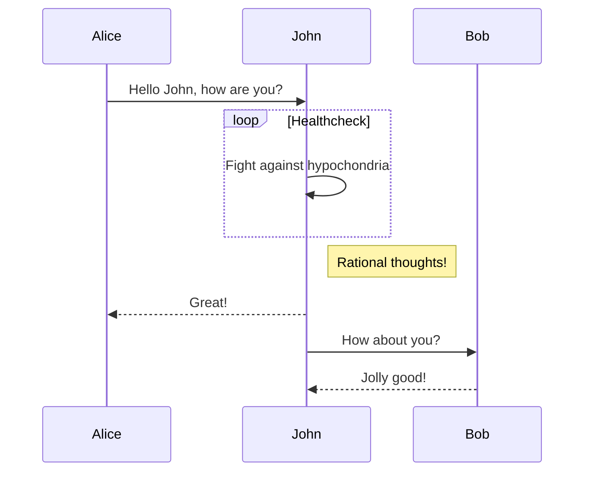

# 测试自动hugo生成
每次都要生成public并生成上传，导致文件越来越多越大，并且每次操作的次数增加，容易出错，这次使用定时操作，拉取完代码自动编译hugo，删除掉public，每次都使用本地的代码生成public。

## TODO
* 测试手机编写自动上传生成页面，这样就可以随时随地的写了
* 手机的授权push是个大问题
  
<table><tr><td bgcolor=black>

[菜鸟教程](https://www.runoob.com)
这个有点意思
</td></tr></table>

