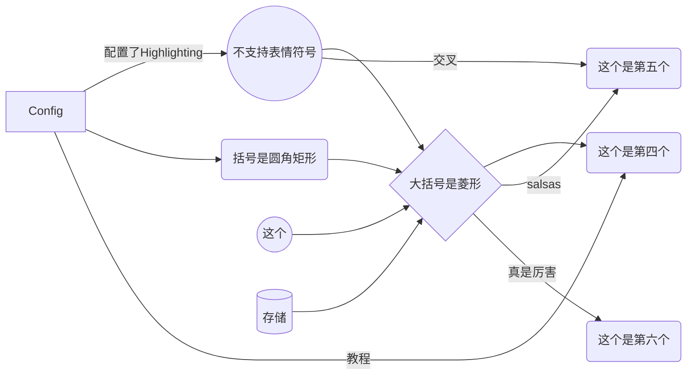
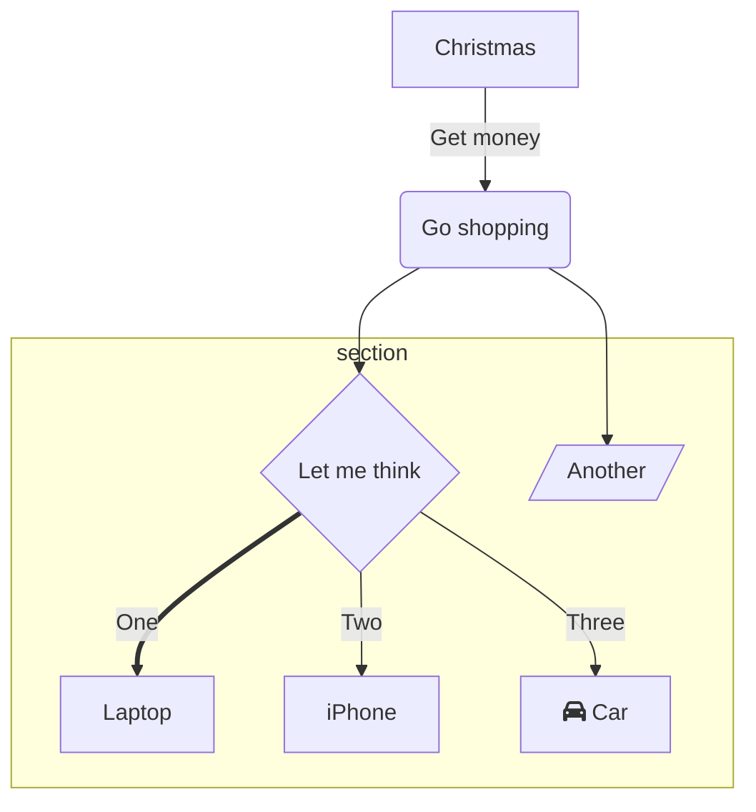
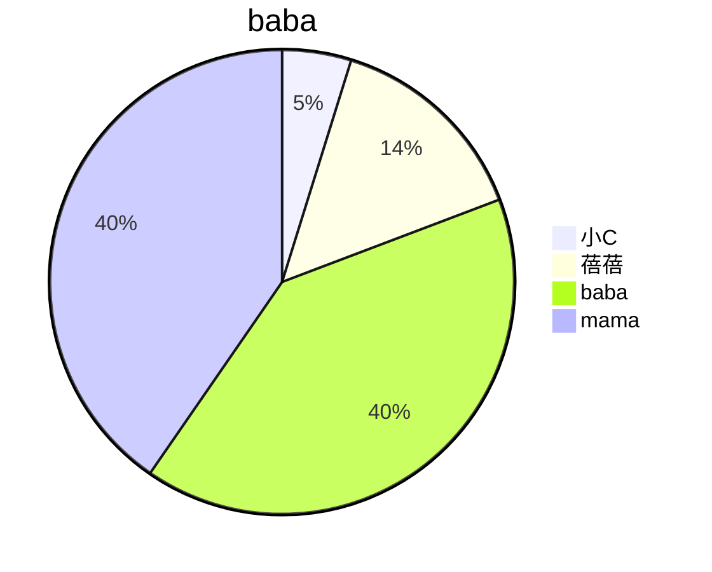
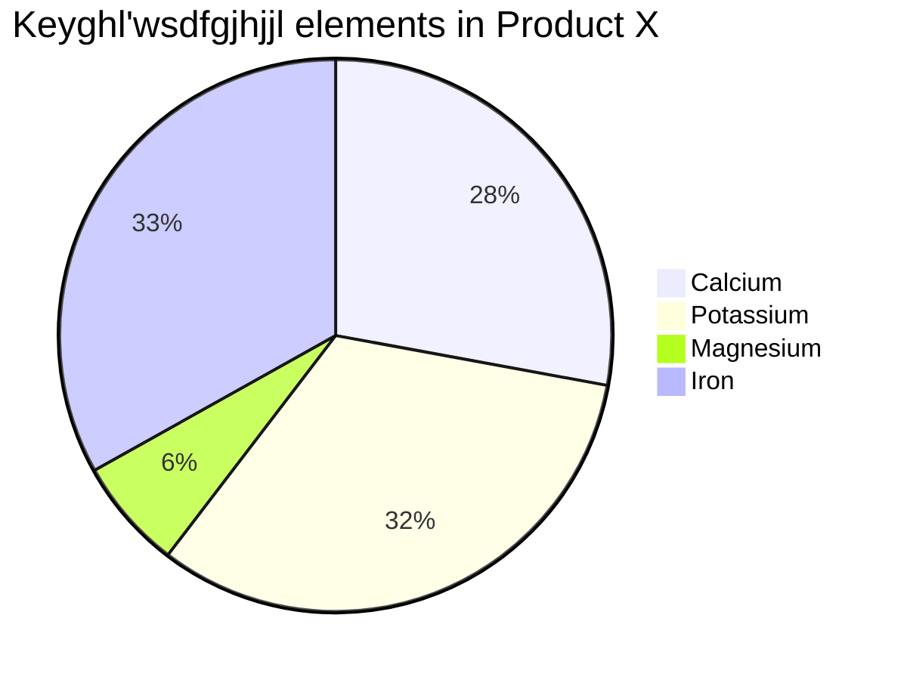
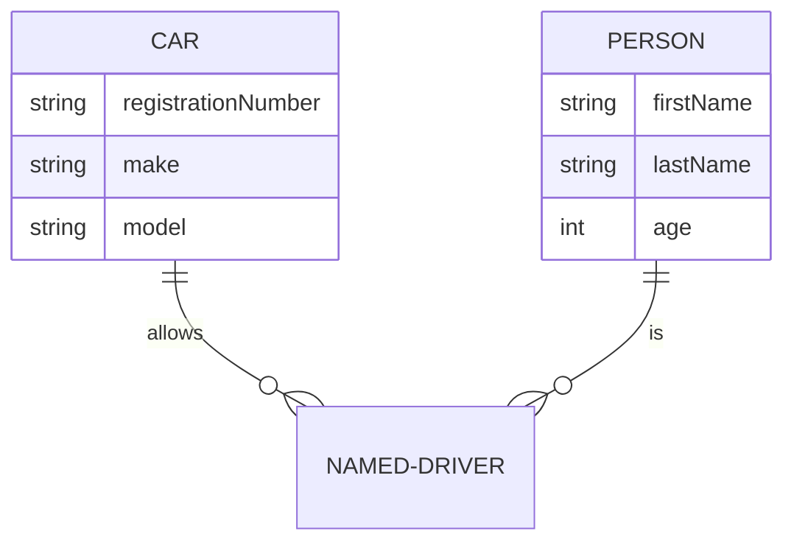
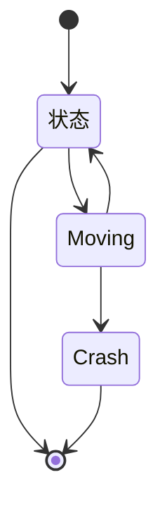
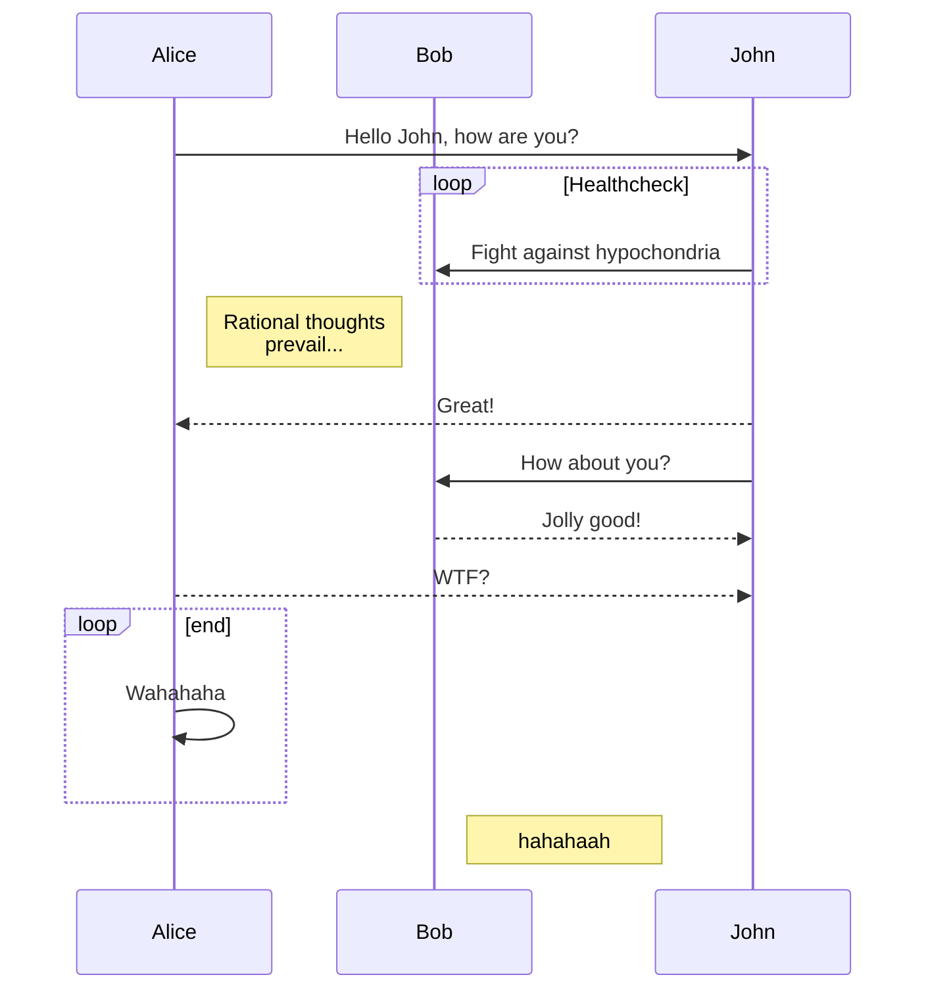
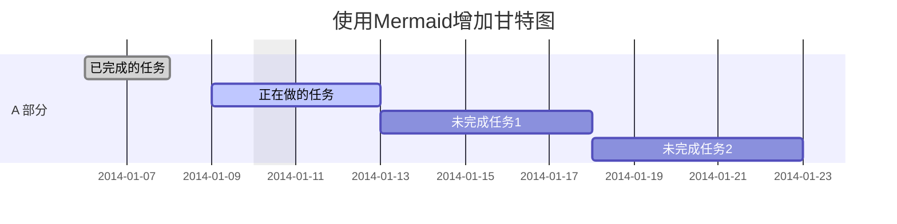
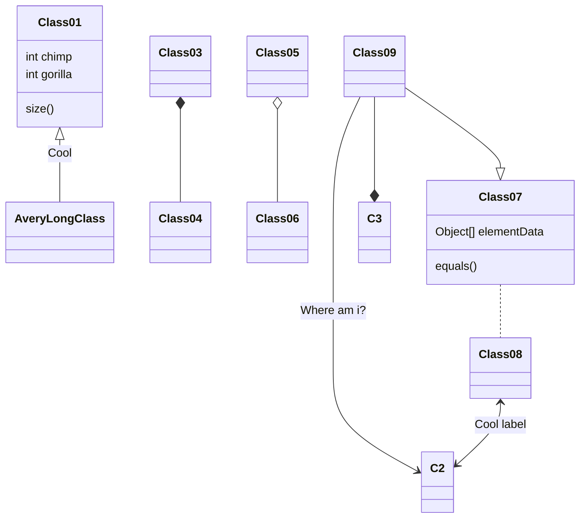
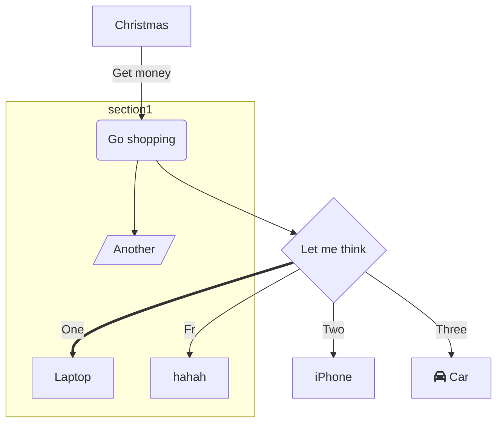

## 终于Mermai完美运行
如果even主题，你打开了 Syntax highlighting by Chroma ,这时候如果添加mermaid, 实际上是mermaid并不能正确的渲染。这是因为 highlighting会修改 lauguage-mermaid,导致后面mermaid不能正确渲染图像。

```mermaid
graph LR
    A[Config] -- 配置了Highlighting --> B((不支持表情符号))
    A --> C(括号是圆角矩形)
    B --> D{大括号是菱形}
    C --> D
    D --> F(这个是第四个)
    D --salsas--> G(这个是第五个)
    D --真是厉害--> H(这个是第六个)
    B --交叉--> G
    A --教程-->F
    W((这个)) --> D
    O[(存储)] --> D
```

``` mermaid
        graph TD
          A[Christmas] -->|Get money| B(Go shopping)
          B --> C{Let me think}
          B --> G[/Another/]
          C ==>|One| D[Laptop]
          C -->|Two| E[iPhone]
          C -->|Three| F[fa:fa-car Car]
          subgraph section
            C
            D
            E
            F
            G
          end
```

``` mermaid
pie
    title baba
    "小C" : 5
    "蓓蓓" : 15
    "baba" : 42
    "mama" :  42
```

``` mermaid
pie
    title Keyghl'wsdfgjhjjl elements in Product X
    "Calcium" : 42.96
    "Potassium" : 50.05
    "Magnesium" : 10.01
    "Iron" :  51
```

``` mermaid
erDiagram
    CAR ||--o{ NAMED-DRIVER : allows
    CAR {
        string registrationNumber
        string make
        string model
    }
    PERSON ||--o{ NAMED-DRIVER : is
    PERSON {
        string firstName
        string lastName
        int age
    }
```
## 可以成功的

> 状态机

``` mermaid
stateDiagram
    [*] --> 状态
    状态 --> [*]
    状态 --> Moving
    Moving --> 状态
    Moving --> Crash
    Crash --> [*]
```

``` mermaid
sequenceDiagram
    participant Alice
    participant Bob
    participant John
    Alice->>John: Hello John, how are you?
    loop Healthcheck
        John->>Bob: Fight against hypochondria
    end
    Note left of Bob: Rational thoughts<br/>prevail...
    John-->>Alice: Great!
    John->>Bob: How about you?
    Bob-->>John: Jolly good!
    Alice-->>John: WTF?
    loop end
        Alice->>Alice: Wahahaha
    end
    Note right of Bob: hahahaah
```

``` mermaid
gantt 
    dateFormat  YYYY-MM-DD
    title 使用Mermaid增加甘特图
    excludes weekdays 2014-01-10

section A 部分
已完成的任务            :done,    des1, 2014-01-06,2014-01-08
正在做的任务               :active,  des2, 2014-01-09, 3d
未完成任务1               :         des3, after des2, 5d
未完成任务2               :         des4, after des3, 5d
```

``` mermaid
classDiagram
Class01 <|-- AveryLongClass : Cool
Class03 *-- Class04
Class05 o-- Class06
Class07 .. Class08
Class09 --> C2 : Where am i?
Class09 --* C3
Class09 --|> Class07
Class07 : equals()
Class07 : Object[] elementData
Class01 : size()
Class01 : int chimp
Class01 : int gorilla
Class08 <--> C2: Cool label
```

``` mermaid
graph TD
    A[Christmas] -->|Get money| B(Go shopping)
    B --> C{Let me think}
    B --> G[/Another/]
    C ==>|One| D[Laptop]
    C -->|Two| E[iPhone]
    C -->|Three| F[fa:fa-car Car]
    C -->|Fr| H[hahah]
    subgraph section1
    B
    H
    D
    G
    
    end
```
