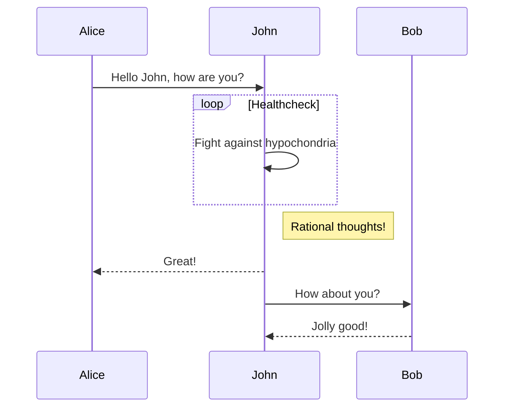
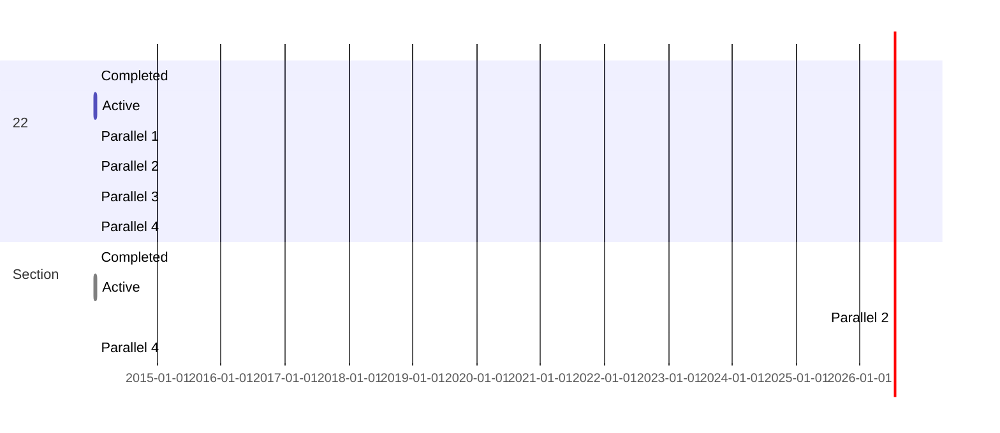
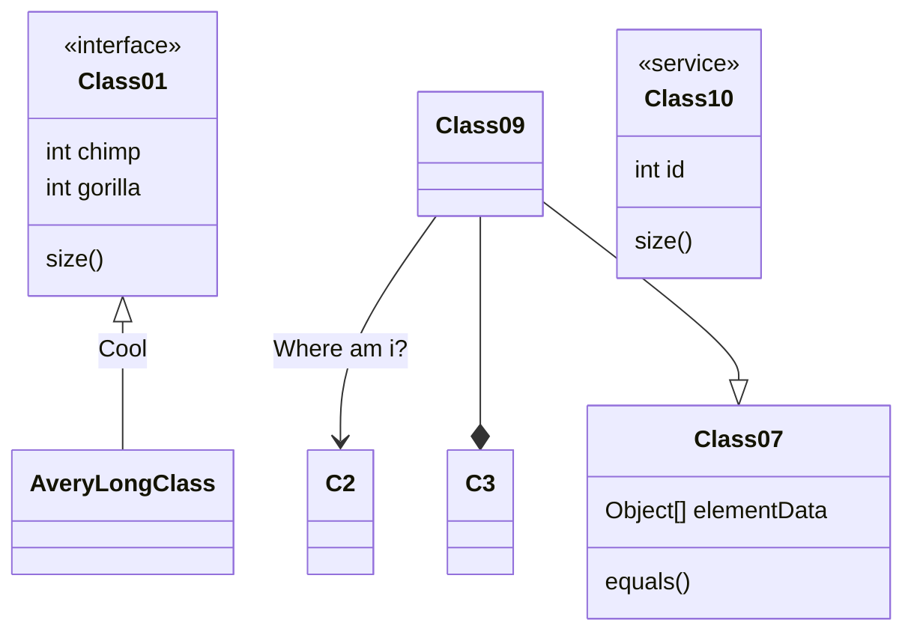
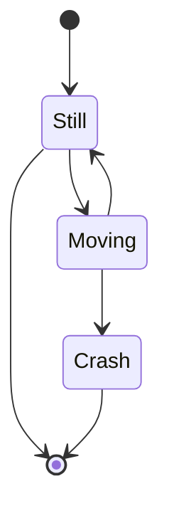

# Markdown 高级用法

### sequenceDiagram

### gantt 甘特图

### classDiagram 类图


### stateDiagram 状态图

code：
>\```mermaid
stateDiagram
[\*] --> Still
Still --> [\*]
Still --> Moving
Moving --> Still
Moving --> Crash
Crash --> [\*]
\```

render：


- [x] Write math example
  - [x] Write diagram example
- [ ] Do something else

