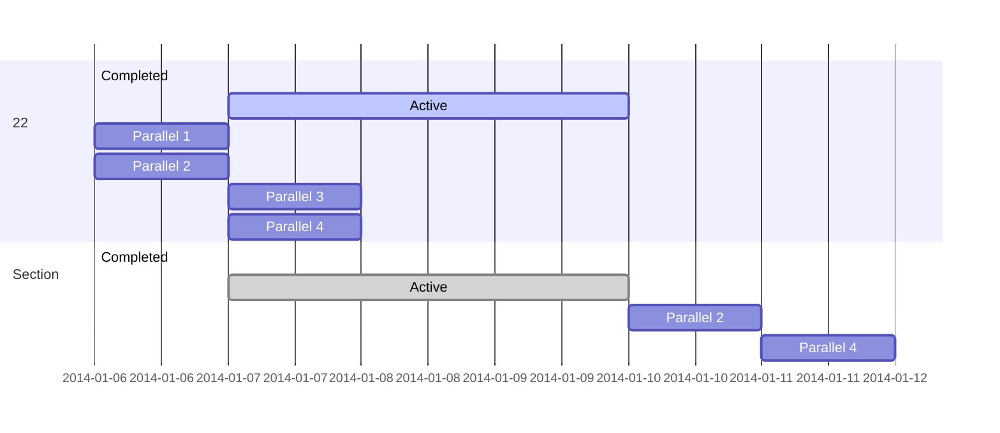
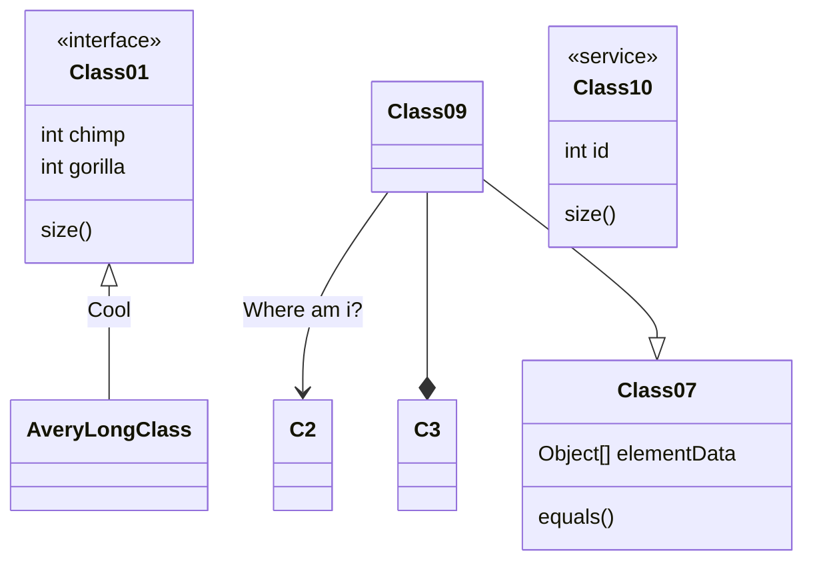
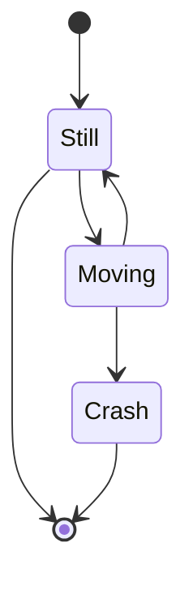

# Markdown 高级用法

> **⚠ WARNING: Aliens are coming.**  
> A description of the colour, smell and dangerous behaviour of the aliens.

## 可以成功的

```flowchart
st=>start: Start|past:>http://www.google.com[blank]
e=>end: End:>http://www.google.com
op1=>operation: My Operation|past
op2=>operation: Stuff|current
sub1=>subroutine: My Subroutine|invalid
cond=>condition: Yes
or No?|approved:>http://www.google.com
c2=>condition: Good idea|rejected
io=>inputoutput: catch something...|request
st->op1(right)->cond
cond(yes, right)->c2
cond(no)->sub1(left)->op1
c2(yes)->io->e
c2(no)->op2->e
```

```sequence
Andrew->China: Says Hello
Note right of China: China thinks\nabout it
China-->Andrew: How are you?
Andrew->>China: I am good thanks!
```

### sequenceDiagram
```sequence
Alice->>John: Hello John, how are you?
loop Healthcheck
    John->>John: Fight against hypochondria
end
Note right of John: Rational thoughts!
John-->>Alice: Great!
John->>Bob: How about you?
Bob->>Alice: Jolly good!
```
### gantt 甘特图

### classDiagram 类图


### stateDiagram 状态图

render：


- [x] Write math example
  - [x] Write diagram example
- [ ] Do something else

